# [📈 Live Status](https://euro.github.io/status): <!--live status--> **🟧 Partial outage**

This repository contains the open-source uptime monitor and status page for USFA, powered by Clutch.

<!--start: status pages-->
<!-- This summary is generated by Upptime (https://github.com/upptime/upptime) -->
<!-- Do not edit this manually, your changes will be overwritten -->

| URL                                                                                                           | Status  | History                                                                                                                                                                        | Response Time                                                                                                               | Uptime                                                                                                                                                                                                                                                                                               |
| ------------------------------------------------------------------------------------------------------------- | ------- | ------------------------------------------------------------------------------------------------------------------------------------------------------------------------------ | --------------------------------------------------------------------------------------------------------------------------- | ---------------------------------------------------------------------------------------------------------------------------------------------------------------------------------------------------------------------------------------------------------------------------------------------------- |
| [USFA Akamai](https://www.usfa.fema.gov)                                                                      | 🟩 Up   | [usfa-akamai.yml](https://github.com/euro/status/commits/master/history/usfa-akamai.yml)                                                                                       | 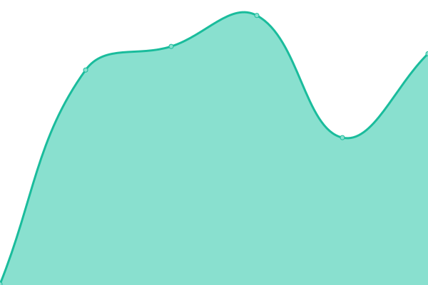 293ms                                            |                                                                                        |
| [USFA Apps](https://apps.usfa.fema.gov)                                                                       | 🟥 Down | [usfa-apps.yml](https://github.com/euro/status/commits/master/history/usfa-apps.yml)                                                                                           | 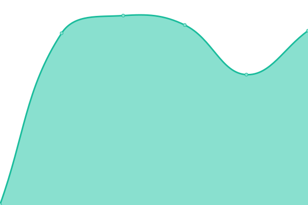 400ms                                              |                                                                                             |
| [USFA NFA](https://nfa.usfa.fema.gov)                                                                         | 🟥 Down | [usfa-nfa.yml](https://github.com/euro/status/commits/master/history/usfa-nfa.yml)                                                                                             |  382ms                                               |                                                                                               |
| [Civilian fatalities](https://apps.usfa.fema.gov/civilian-fatalities)                                         | 🟥 Down | [civilian-fatalities.yml](https://github.com/euro/status/commits/master/history/civilian-fatalities.yml)                                                                       |  574ms                                    |                                                                         |
| [Contact - NFA courses voucher](https://apps.usfa.fema.gov/contact/voucher)                                   | 🟥 Down | [contact-nfa-courses-voucher.yml](https://github.com/euro/status/commits/master/history/contact-nfa-courses-voucher.yml)                                                       |  103ms                            |                                                         |
| [Contact - Register for Fire is Everyones Fight materials](https://apps.usfa.fema.gov/contact/fief)           | 🟥 Down | [contact-register-for-fire-is-everyones-fight-materials.yml](https://github.com/euro/status/commits/master/history/contact-register-for-fire-is-everyones-fight-materials.yml) | 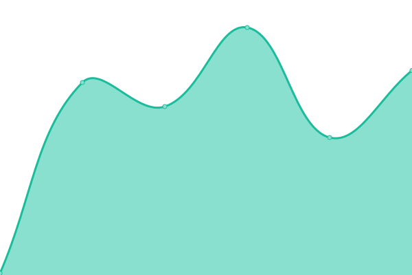 105ms |  |
| [Contact - Qualitative feedback on analytical reports](https://apps.usfa.fema.gov/contact/dataReportEval)     | 🟥 Down | [contact-qualitative-feedback-on-analytical-reports.yml](https://github.com/euro/status/commits/master/history/contact-qualitative-feedback-on-analytical-reports.yml)         |  83ms      |           |
| [Contact - NFIRS tech support form](https://apps.usfa.fema.gov/contact/ntsc)                                  | 🟥 Down | [contact-nfirs-tech-support-form.yml](https://github.com/euro/status/commits/master/history/contact-nfirs-tech-support-form.yml)                                               | 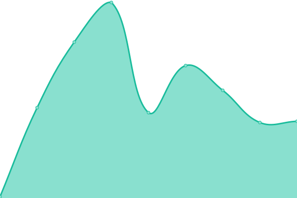 79ms                         |                                                 |
| [Contact - NFA transcript request](https://apps.usfa.fema.gov/contact/transcript)                             | 🟥 Down | [contact-nfa-transcript-request.yml](https://github.com/euro/status/commits/master/history/contact-nfa-transcript-request.yml)                                                 |  84ms                          |                                                   |
| [Contact - Library research consultation request](https://apps.usfa.fema.gov/contact/researchConsult)         | 🟥 Down | [contact-library-research-consultation-request.yml](https://github.com/euro/status/commits/master/history/contact-library-research-consultation-request.yml)                   | 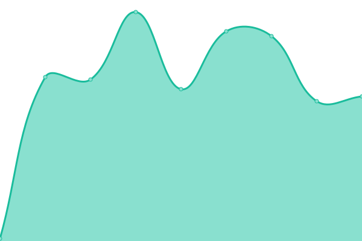 79ms           |                     |
| [Fire department registry](https://apps.usfa.fema.gov/registry)                                               | 🟥 Down | [fire-department-registry.yml](https://github.com/euro/status/commits/master/history/fire-department-registry.yml)                                                             |  200ms                               |                                                               |
| [Firefighter fatalities](https://apps.usfa.fema.gov/firefighter-fatalities)                                   | 🟥 Down | [firefighter-fatalities.yml](https://github.com/euro/status/commits/master/history/firefighter-fatalities.yml)                                                                 | 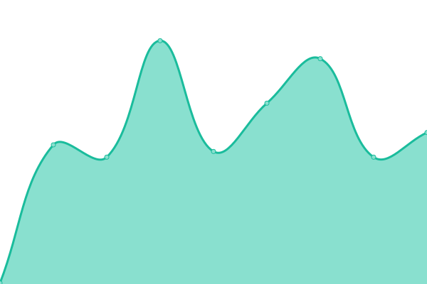 154ms                                 |                                                                   |
| [Hotel/Motel](https://apps.usfa.fema.gov/hotel)                                                               | 🟥 Down | [hotel-motel.yml](https://github.com/euro/status/commits/master/history/hotel-motel.yml)                                                                                       |  1552ms                                           |                                                                                         |
| [Hotel/Motel state management](https://apps.usfa.fema.gov/hotel/state_management)                             | 🟥 Down | [hotel-motel-state-management.yml](https://github.com/euro/status/commits/master/history/hotel-motel-state-management.yml)                                                     | 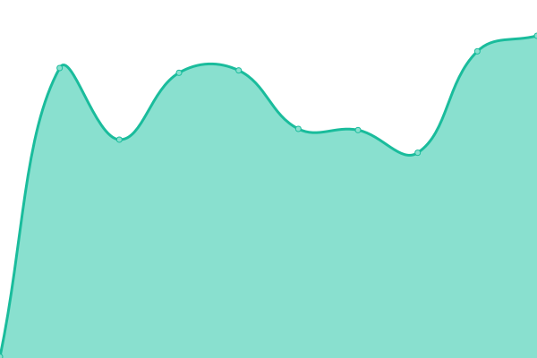 1221ms                          |                                                       |
| [NFAcourses](https://apps.usfa.fema.gov/nfacourses)                                                           | 🟥 Down | [nf-acourses.yml](https://github.com/euro/status/commits/master/history/nf-acourses.yml)                                                                                       | 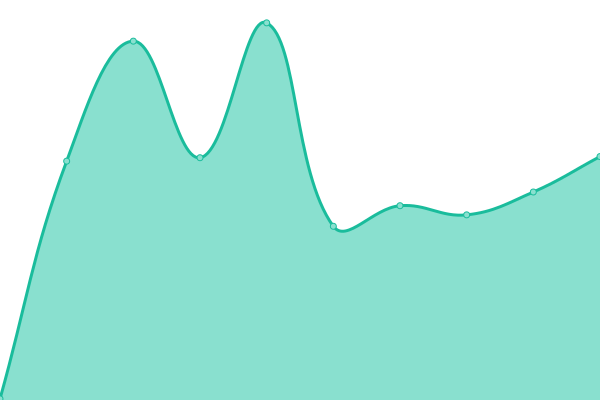 184ms                                            |                                                                                         |
| [NFAcourses - Instructor](https://apps.usfa.fema.gov/nfacourses/instructor)                                   | 🟥 Down | [nf-acourses-instructor.yml](https://github.com/euro/status/commits/master/history/nf-acourses-instructor.yml)                                                                 | 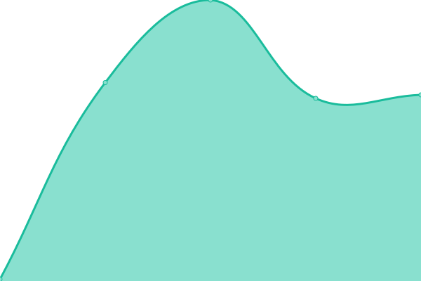 116ms                                 |                                                                   |
| [NFAcourses - Course call](https://apps.usfa.fema.gov/nfacourses/courseCall)                                  | 🟥 Down | [nf-acourses-course-call.yml](https://github.com/euro/status/commits/master/history/nf-acourses-course-call.yml)                                                               | 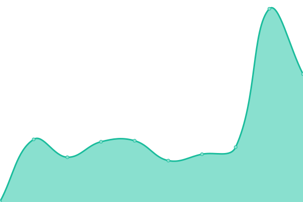 153ms                                |                                                                 |
| [NFAcourses - Distance learning evaluation](https://apps.usfa.fema.gov/nfacourses/DistanceLearningEvaluation) | 🟥 Down | [nf-acourses-distance-learning-evaluation.yml](https://github.com/euro/status/commits/master/history/nf-acourses-distance-learning-evaluation.yml)                             | 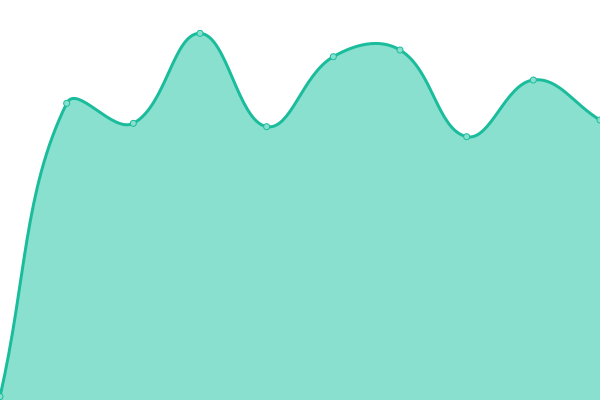 94ms                |                               |
| [NFAcourses - End of course evaluation](https://apps.usfa.fema.gov/nfacourses/eoc)                            | 🟥 Down | [nf-acourses-end-of-course-evaluation.yml](https://github.com/euro/status/commits/master/history/nf-acourses-end-of-course-evaluation.yml)                                     | 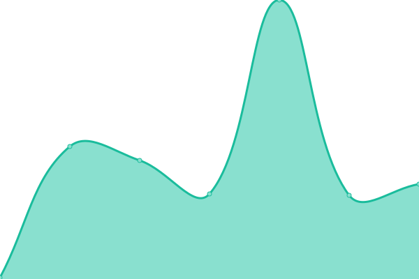 67ms                    |                                       |
| [NFAcourses - Long term evaluation](https://apps.usfa.fema.gov/nfacourses/longTermEvaluation)                 | 🟥 Down | [nf-acourses-long-term-evaluation.yml](https://github.com/euro/status/commits/master/history/nf-acourses-long-term-evaluation.yml)                                             | 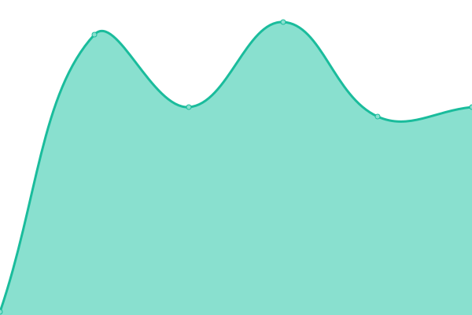 67ms                        |                                               |
| [Publications](https://apps.usfa.fema.gov/publications)                                                       | 🟥 Down | [publications.yml](https://github.com/euro/status/commits/master/history/publications.yml)                                                                                     |  273ms                                           |                                                                                       |
| [Thesaurus](https://apps.usfa.fema.gov/thesaurus)                                                             | 🟥 Down | [thesaurus.yml](https://github.com/euro/status/commits/master/history/thesaurus.yml)                                                                                           |  231ms                                              |                                                                                             |

<!--end: status pages-->

[**Visit our status website →**](https://euro.github.io/status)

## 📄 License

- Code: [MIT](./LICENSE) © [Greg](https://euro.github.io/status)
- Data in the `./history` directory: [Open Database License](https://opendatacommons.org/licenses/odbl/1-0/)
